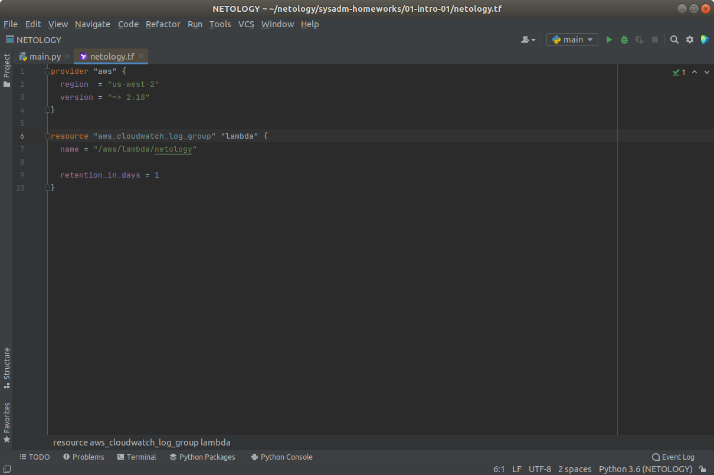
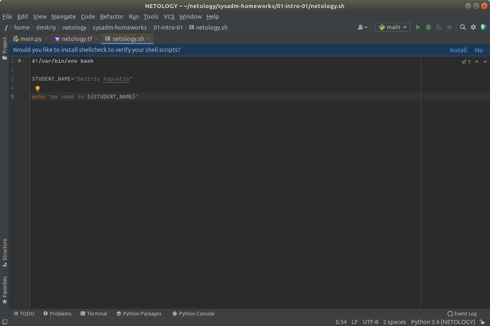
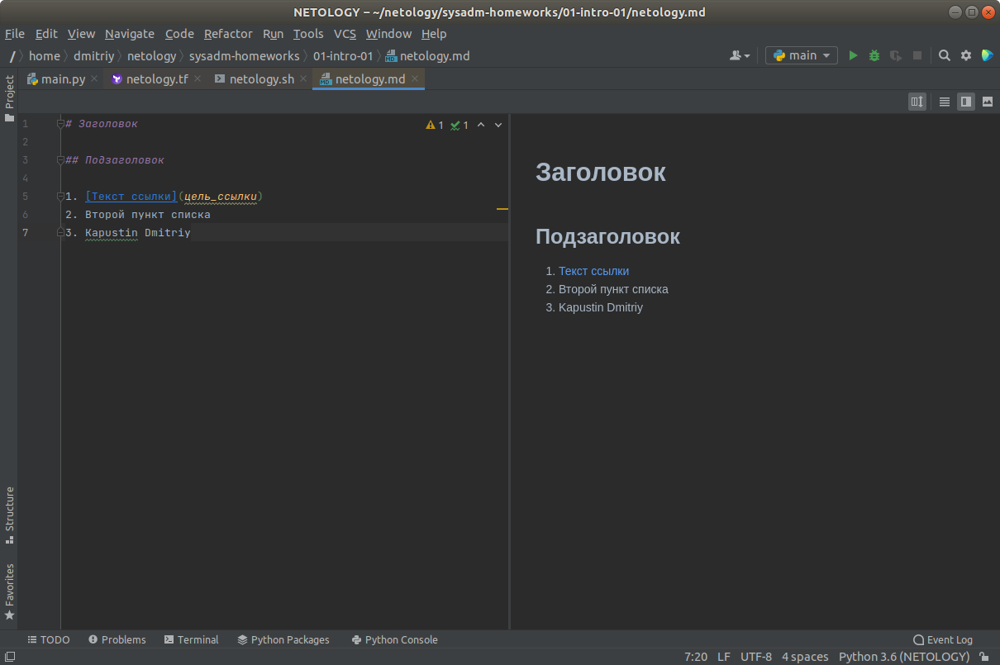
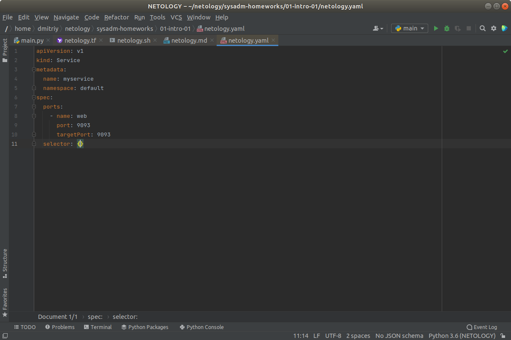
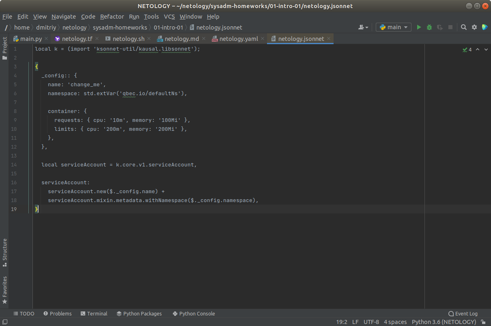
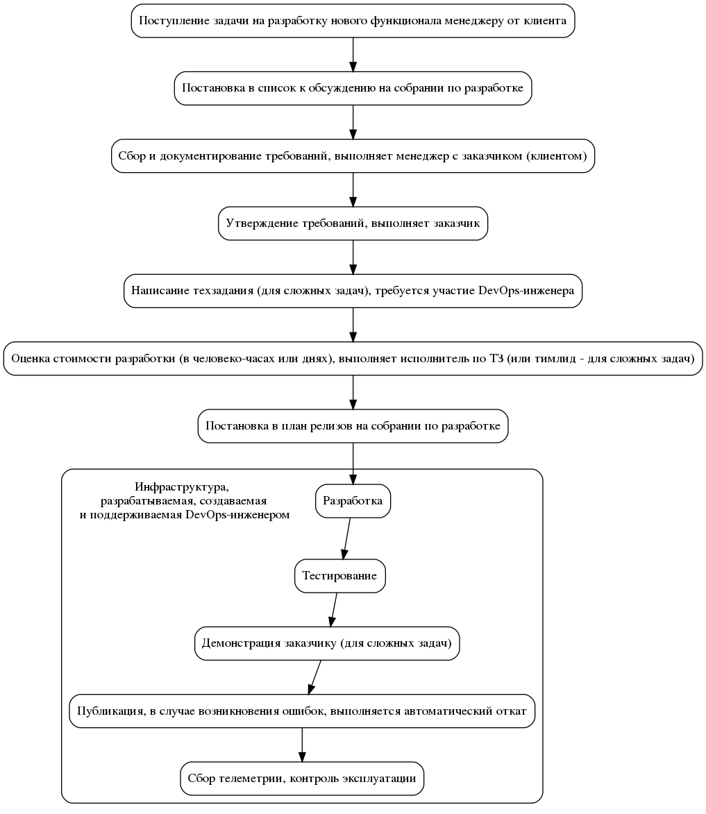

01-intro-01

1.1 Установил плагины:

    - Terraform,
    - BashSupport,
    - MarkDown,
    - Yaml/Ansible Support,
    - Jsonnet.
1.2 Создал файлы для проверки плагинов, на основе файлов из репозитория:

    - [netology.tf](netology.tf) – терраформ,
    - [netology.sh](netology.sh) – bash,
    - [netology.md](netology.md) – markdown, 
    - [netology.yaml](netology.yaml) – yaml,
    - [netology.jsonnet](netology.jsonnet) – jsonnet.

1.3 Убедился, что работает подсветка синтаксиса, файлы выглядят так:

    - Terraform: 
    - Bash: 
    - Markdown: 
    - Yaml: 
    - Jsonnet: 

1.4 ссылки на файлы, на сервисе обмена картинками

https://ibb.co/HYPvjYN
https://ibb.co/mt5Nj3w
https://ibb.co/c11M702
https://ibb.co/MZB8MG2
https://ibb.co/qsQv97j

2. Описание жизненного цикла задачи (разработки нового функционала)

2.1  Поступление задачи на разработку нового функционала менеджеру от клиента.

2.2  Постановка в список к обсуждению на собрании по разработке.

2.3  Сбор и документирование требований, выполняет менеджер с заказчиком (клиентом).

2.4  Утверждение требований, выполняет заказчик.

2.5  Написание техзадания (для сложных задач), требуется участие DevOps-инженера

2.6  Оценка стоимости разработки (в человеко-часах или днях), выполняет исполнитель по ТЗ (или тимлид - для сложных задач).

2.7  Постановка в план релизов на собрании по разработке.

2.8  Разработка - Требуется инфраструктура, разрабытываемая DevOps-инженером.

2.9  Тестирование - Требуется инфраструктура, разрабытываемая DevOps-инженером.

2.10 Демонстрация заказчику (для сложных задач) - Требуется инфраструктура, разрабытываемая DevOps-инженером.

2.11 Публикация, в случае возникновения ошибок, выполняется автоматический откат - Требуется инфраструктура, разрабытываемая DevOps-инженером.

2.12. Сбор телеметрии, контроль эксплуатации - Требуется инфраструктура, разрабытываемая DevOps-инженером.

Схема жизненного цикла задачи: 