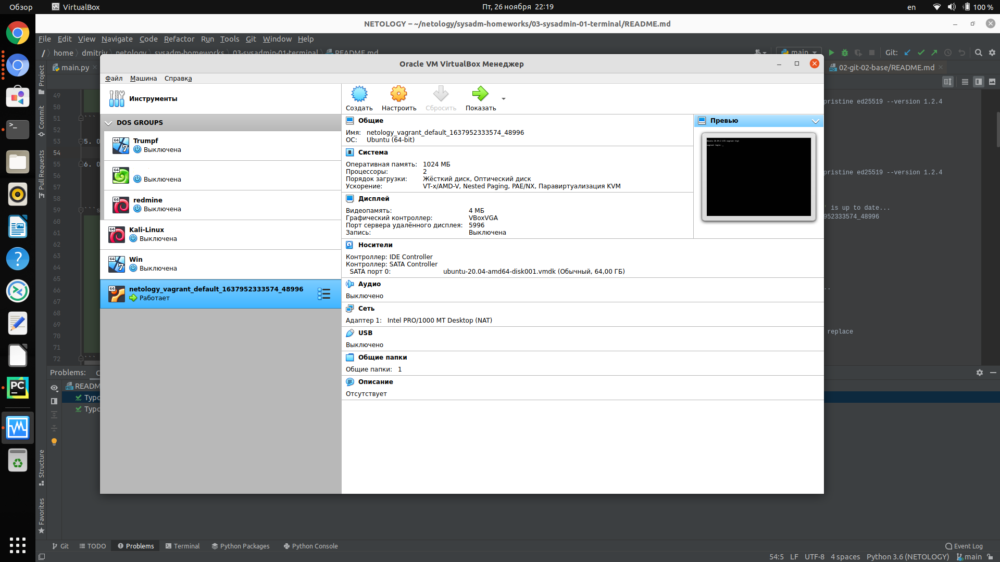
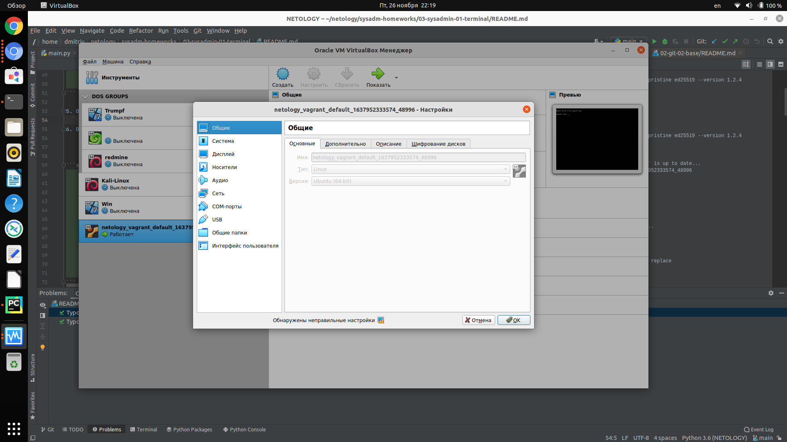

# Домашнее задание к занятию "3.1. Работа в терминале, лекция 1"

1. Установите средство виртуализации [Oracle VirtualBox](https://www.virtualbox.org/).

2. Установите средство автоматизации [Hashicorp Vagrant](https://www.vagrantup.com/).

3. В вашем основном окружении подготовьте удобный для дальнейшей работы терминал. Можно предложить:

4. С помощью базового файла конфигурации запустите Ubuntu 20.04 в VirtualBox посредством Vagrant:


    Ответ:   
```shell
    dmitriy@dellix:~netology/vagrant_netology$ vagrant init
    Ignoring ed25519-1.2.4 because its extensions are not built. Try: gem pristine ed25519 --version 1.2.4
    A `Vagrantfile` has been placed in this directory. You are now
    ready to `vagrant up` your first virtual environment! Please read
    the comments in the Vagrantfile as well as documentation on
    `vagrantup.com` for more information on using Vagrant.
    dmitriy@dellix:~netology/vagrant_netology$ >Vagrantfile 
    dmitriy@dellix:~netology/vagrant_netology$ vi Vagrantfile 
    dmitriy@dellix:~/netology/vagrant_netology$ vagrant up
    Ignoring ed25519-1.2.4 because its extensions are not built. Try: gem pristine ed25519 --version 1.2.4
    Bringing machine 'default' up with 'virtualbox' provider...
    ==> default: Importing base box 'bento/ubuntu-20.04'...
    ==> default: Matching MAC address for NAT networking...
    ==> default: Checking if box 'bento/ubuntu-20.04' version '202107.28.0' is up to date...
    ==> default: Setting the name of the VM: vagrant_netology_default_1637952333574_48996
    ==> default: Fixed port collision for 22 => 2222. Now on port 2200.
    ==> default: Clearing any previously set network interfaces...
    ==> default: Preparing network interfaces based on configuration...
        default: Adapter 1: nat
    ==> default: Forwarding ports...
        default: 22 (guest) => 2200 (host) (adapter 1)
    ==> default: Booting VM...
    ==> default: Waiting for machine to boot. This may take a few minutes...
        default: SSH address: 127.0.0.1:2200
        default: SSH username: vagrant
        default: SSH auth method: private key
        default: 
        default: Vagrant insecure key detected. Vagrant will automatically replace
        default: this with a newly generated keypair for better security.
        default: 
        default: Inserting generated public key within guest...
        default: Removing insecure key from the guest if it's present...
        default: Key inserted! Disconnecting and reconnecting using new SSH key...
    ==> default: Machine booted and ready!
    ==> default: Checking for guest additions in VM...
    ==> default: Mounting shared folders...
        default: /vagrant => /home/dmitriy/netology/vagrant_netology
```

5. Ознакомьтесь с графическим интерфейсом VirtualBox, посмотрите как выглядит виртуальная машина, которую создал для вас Vagrant, какие аппаратные ресурсы ей выделены. Какие ресурсы выделены по-умолчанию?

    
    

6. Ознакомьтесь с возможностями конфигурации VirtualBox через Vagrantfile: [документация](https://www.vagrantup.com/docs/providers/virtualbox/configuration.html). Как добавить оперативной памяти или ресурсов процессора виртуальной машине?


    Ответ:
```shell
 

    dmitriy@dellix:~$ cat netology/vagrant_netology/Vagrantfile 
     Vagrant.configure("2") do |config|
     	    config.vm.box = "bento/ubuntu-20.04"
            config.vm.provider "virtualbox" do |v|
                v.memory = 1224
                v.cpus = 3
            end
     end

    dmitriy@dellix:~$ vagrant reload
```

7. Команда `vagrant ssh` из директории, в которой содержится Vagrantfile, позволит вам оказаться внутри виртуальной машины без каких-либо дополнительных настроек. Попрактикуйтесь в выполнении обсуждаемых команд в терминале Ubuntu.

    Ответ:
```shell
    dmitriy@dellix:~/netology/vagrant_netology$ vagrant up
    Ignoring ed25519-1.2.4 because its extensions are not built. Try: gem pristine ed25519 --version 1.2.4
    Bringing machine 'default' up with 'virtualbox' provider...
    ==> default: Checking if box 'bento/ubuntu-20.04' version '202107.28.0' is up to date...
    ==> default: Resuming suspended VM...
    ==> default: Booting VM...
    ==> default: Waiting for machine to boot. This may take a few minutes...
        default: SSH address: 127.0.0.1:2222
        default: SSH username: vagrant
        default: SSH auth method: private key
    ==> default: Machine booted and ready!
    ==> default: Machine already provisioned. Run `vagrant provision` or use the `--provision`
    ==> default: flag to force provisioning. Provisioners marked to run always will still run.
    dmitriy@dellix:~/netology/vagrant_netology$ vagrant ssh
    Ignoring ed25519-1.2.4 because its extensions are not built. Try: gem pristine ed25519 --version 1.2.4
    Welcome to Ubuntu 20.04.2 LTS (GNU/Linux 5.4.0-80-generic x86_64)

     * Documentation:  https://help.ubuntu.com
     * Management:     https://landscape.canonical.com
     * Support:        https://ubuntu.com/advantage

      System information as of Fri 26 Nov 2021 06:56:37 PM UTC

      System load:  0.09              Processes:             121
      Usage of /:   2.5% of 61.31GB   Users logged in:       0
      Memory usage: 17%               IPv4 address for eth0: 10.0.2.15
      Swap usage:   0%


    This system is built by the Bento project by Chef Software
    More information can be found at https://github.com/chef/bento
    Last login: Fri Nov 19 23:35:59 2021 from 10.0.2.2
```

8. Ознакомиться с разделами `man bash`, почитать о настройках самого bash:
    * какой переменной можно задать длину журнала `history`, и на какой строчке manual это описывается?
    
    Ответ:
```shell
           HISTSIZE
              The  number of commands to remember in the command history (see HISTORY below).  If the value is 0, commands are not saved in the history list.  Numeric values less than zero result in
              every command being saved on the history list (there is no limit).  The shell sets the default value to 500 after reading any startup files.


    * что делает директива `ignoreboth` в bash?
    Ответ: директива `ignoreboth` включает в себя действие двух директив `ignorespace` (не записывать в history строки, начинающиеся с пробела) 
    и  `ignoredups` (не записывать в history повторяющиеся строки)
```

9. В каких сценариях использования применимы скобки `{}` и на какой строчке `man bash` это описано?

    Ответ:
```shell
    
     { list; }
              list is simply executed in the current shell environment.  list must be terminated with a newline or semicolon.  This is known as a group command.  The return status is the exit status
              of list.  Note that unlike the metacharacters ( and ), { and } are reserved words and must occur where a reserved word is permitted to be recognized.  Since they do not  cause  a  word
              break, they must be separated from list by whitespace or another shell metacharacter.
     { список; }         
              список просто выполняется в текущей среде оболочки. Список должен заканчиваться новой 
              строкой или точкой с запятой. Эта команда называется командой группы. Статус 
              возврата - это статус выхода из списка. Следует отметить, что в отличие от 
              метасимволов (и), {и} являются зарезервированными словами и должны использоваться там, 
              где зарезервированное слово разрешено распознавать. Поскольку они не вызывают разрыва 
              слов, их необходимо отделить от списка пробелом или другим метасимволом оболочки.
     ```

10. С учётом ответа на предыдущий вопрос, как создать однократным вызовом `touch` 100000 файлов? Получится ли аналогичным образом создать 300000? Если нет, то почему?

    Ответ:
```shell
           dmitriy@dellix:/tmp/test$ touch {1..100000}
           dmitriy@dellix:/tmp/test$ rm {1..100000}
           dmitriy@dellix:/tmp/test$ touch {1..300000}
           bash: /usr/bin/touch: Слишком длинный список аргументов
           при создании 300000 файлов срабатывает ограничение ядра на длину командной строки.
           dmitriy@dellix:/tmp/test$ getconf ARG_MAX
           2097152
 ```
 
11. В man bash поищите по `/\[\[`. Что делает конструкция `[[ -d /tmp ]]`

    Ответ:
```shell

     [[ expression ]] Return a status of 0 or 1 depending on the evaluation of the conditional expression expression.  Expressions are composed of the primaries described  below  under  CONDITIONAL  EXPRES‐
              SIONS.   Word  splitting  and  pathname expansion are not performed on the words between the [[ and ]]; tilde expansion, parameter and variable expansion, arithmetic expansion, command
              substitution, process substitution, and quote removal are performed.  Conditional operators such as -f must be unquoted to be recognized as primaries.

              When used with [[, the < and > operators sort lexicographically using the current locale.
          
              Двойные квадратные скобки это команда или, скорее ключевое слово bash, все что после них, воспринимается, как аргумент, а закрывающие квадратные скобки, говорят о том, что аргументы закончились
              Например в выражениях
               
              vagrant@vagrant:~$ if [[ -d /tmp ]] ; then echo 1 ; else echo 0; fi
              1
              если каталог /tmp существует, вывести - 1, каталог существует программа выведет - 1.

              vagrant@vagrant:~$ if ! [[ -d /tmp ]] ; then echo 1 ; else echo 0; fi
              0
              если каталог /tmp не существует вывести - 1, каталог существует, при условии отрицания (!), программа выведет 0.

              vagrant@vagrant:~$ if [[ -d /tmp2 ]] ; then echo 1 ; else echo 0; fi
              0
              если каталог /tmp2 существует, вывести - 1. каталог не существует, поэтому программа выведет - 0
```

12. Основываясь на знаниях о просмотре текущих (например, PATH) и установке новых переменных; командах, которые мы рассматривали, добейтесь в выводе type -a bash в виртуальной машине наличия первым пунктом в списке:

    Ответ:
```shell
  
    vagrant@vagrant:~$ type -a bash
    bash is /usr/bin/bash
    bash is /bin/bash
    vagrant@vagrant:~$ ln -s /usr/bin/bash /tmp/new_path_directory/bash
    vagrant@vagrant:~$ export PATH=/tmp/new_path_directory/:$PATH
    vagrant@vagrant:~$ type -a bash
    bash is /tmp/new_path_directory/bash
    bash is /usr/bin/bash
    bash is /bin/bash
```

13. Чем отличается планирование команд с помощью `batch` и `at`?
     
             
    Ответ: batch запускает задание на выполнение, когда загрузка системы (Load Average) ниже 1.5 (или другое число, указанное при вызове демона atd) 
    at - однократно выполняет задание в указанное время.
         
14. Завершите работу виртуальной машины чтобы не расходовать ресурсы компьютера и/или батарею ноутбука.
         
    Ответ:
```shell  
       
    CTRL + D
    vagrant@vagrant:~$ logout
    Connection to 127.0.0.1 closed.
    dmitriy@dellix:~/netology/vagrant_netology$ vagrant suspend 
    Ignoring ed25519-1.2.4 because its extensions are not built. Try: gem pristine ed25519 --version 1.2.4
    ==> default: Saving VM state and suspending execution...
```
