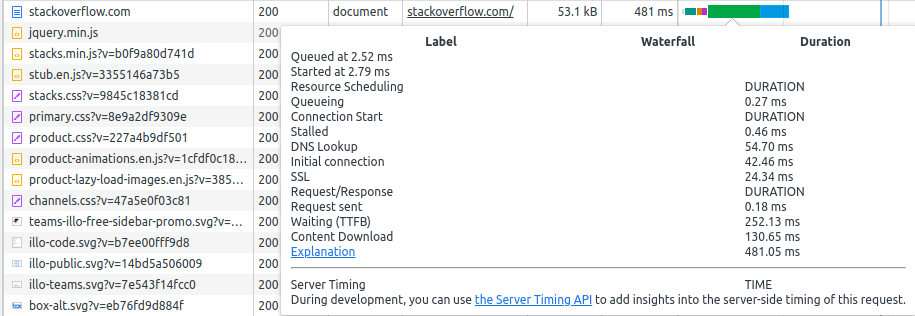
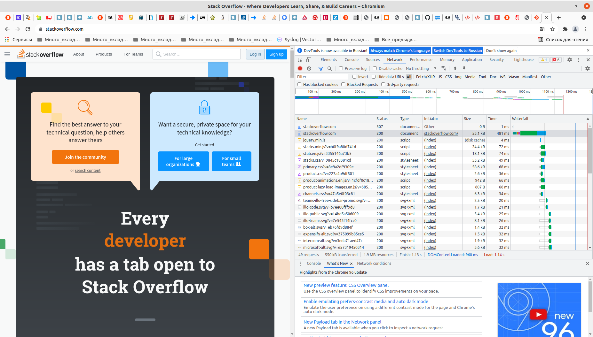

# Домашнее задание к занятию "3.6. Компьютерные сети, лекция 1"

1. Работа c HTTP через телнет.
- Подключитесь утилитой телнет к сайту stackoverflow.com
`telnet stackoverflow.com 80`
- отправьте HTTP запрос
```bash
GET /questions HTTP/1.0
HOST: stackoverflow.com
[press enter]
[press enter]
```
- В ответе укажите полученный HTTP код, что он означает?


Ответ:  Код состояния HTTP 301 или Moved Permanently (с англ. — «Перемещено навсегда») — стандартный код ответа HTTP, получаемый в ответ от сервера в ситуации, когда запрошенный ресурс был на постоянной основе перемещён в новое месторасположение, и указывающий на то, что текущие ссылки, использующие данный URL, должны быть обновлены.
```bash
vagrant@vagrant:~$ telnet stackoverflow.com 80
Trying 151.101.1.69...
Connected to stackoverflow.com.
Escape character is '^]'.
GET /questions HTTP/1.0
HOST: stackoverflow.com

HTTP/1.1 301 Moved Permanently
cache-control: no-cache, no-store, must-revalidate
location: https://stackoverflow.com/questions
x-request-guid: 127f1fef-c91d-45f6-bf57-4d330b8f04f1
feature-policy: microphone 'none'; speaker 'none'
content-security-policy: upgrade-insecure-requests; frame-ancestors 'self' https://stackexchange.com
Accept-Ranges: bytes
Date: Thu, 06 Jan 2022 02:39:48 GMT
Via: 1.1 varnish
Connection: close
X-Served-By: cache-hel1410024-HEL
X-Cache: MISS
X-Cache-Hits: 0
X-Timer: S1641436788.274851,VS0,VE117
Vary: Fastly-SSL
X-DNS-Prefetch-Control: off
Set-Cookie: prov=f9e97436-f456-5d1c-f88c-97168b11ea5d; domain=.stackoverflow.com; expires=Fri, 01-Jan-2055 00:00:00 GMT; path=/; HttpOnly

Connection closed by foreign host.
```

2. Повторите задание 1 в браузере, используя консоль разработчика F12.
- откройте вкладку `Network`
- отправьте запрос http://stackoverflow.com
- найдите первый ответ HTTP сервера, откройте вкладку `Headers`
```shell
Request URL: http://stackoverflow.com/
Request Method: GET
Status Code: 307 Internal Redirect
Referrer Policy: strict-origin-when-cross-origin
```
- укажите в ответе полученный HTTP код.
```text
Код состояния HTTP 307 (временное перенаправление) указывает, что целевой ресурс 
временно находится под другим URI, и пользовательский агент НЕ ДОЛЖЕН изменять 
метод запроса, если он выполняет автоматическое перенаправление на этот URI. 
Поскольку перенаправление может меняться со временем, клиент должен продолжать 
использовать исходный действующий URI запроса для будущих запросов.
```
- проверьте время загрузки страницы, какой запрос обрабатывался дольше всего?
```text
Время загрузки 1.14 секунд
Самый долгий запрос - загрузка документа stackoverflow.com, точнее, параметр Waiting (TTFB) - время 
на получение первого байта, в данном случае на него ушло 252.13 ms. В этот параметр входят 
все временные задержки, на пути от пользователя (запрос) до севера, обработка на сервере 
и ответ от сервера, т.к. задержек много, снижение этого параметра может оказаться сложной задачей, 
треующей например внесения дополнительных заголовков, с таймингами на все возможные операции, 
происходящие на сервере. А в простом случае может быть "виновата" последняя миля до клиента.  
 
```

- приложите скриншот консоли браузера в ответ.

3. Какой IP адрес у вас в интернете?
```bash
vagrant@vagrant:~$ curl 2ip.ru
46.22.56.XX
```
4. Какому провайдеру принадлежит ваш IP адрес? Какой автономной системе AS? Воспользуйтесь утилитой `whois`
```bash
vagrant@vagrant:~$ curl 2ip.ru | while read str; do whois -h whois.ripe.net $str; done | sed -n '/org-name:/p; /origin:/p'
  % Total    % Received % Xferd  Average Speed   Time    Time     Time  Current
                                 Dload  Upload   Total   Spent    Left  Speed
100    12  100    12    0     0    107      0 --:--:-- --:--:-- --:--:--   107
org-name:       GRANLINE
origin:         AS203806
```
Провайдер: GRANLINE, Автономная система: AS203806

5. Через какие сети проходит пакет, отправленный с вашего компьютера на адрес 8.8.8.8? Через какие AS? Воспользуйтесь утилитой traceroute
```bash
vagrant@vagrant:~$ traceroute -An 8.8.8.8
traceroute to 8.8.8.8 (8.8.8.8), 30 hops max, 60 byte packets
 1  10.0.2.2 [*]  0.473 ms  0.378 ms  0.329 ms
 2  192.168.1.254 [*]  1.803 ms  2.162 ms  2.138 ms
 3  10.16.16.1 [*]  4.546 ms  4.390 ms  4.318 ms
 4  46.22.56.2 [AS203806]  4.213 ms  4.153 ms  4.107 ms
 5  46.22.56.1 [AS203806]  5.831 ms  7.621 ms  7.543 ms
 6  91.224.127.253 [AS12722]  4.436 ms  3.650 ms  3.420 ms
 7  195.209.63.255 [AS12722]  3.356 ms 142.250.47.108 [AS15169]  5.221 ms 195.209.63.255 [AS12722]  4.965 ms
 8  * * 142.250.47.108 [AS15169]  5.670 ms
 9  * * 108.170.250.33 [AS15169]  5.871 ms
10  108.170.250.34 [AS15169]  5.822 ms 108.170.250.51 [AS15169]  5.073 ms  5.026 ms
11  142.251.49.24 [AS15169]  20.617 ms  20.552 ms 108.170.250.99 [AS15169]  15.499 ms
12  216.239.51.32 [AS15169]  35.996 ms 74.125.253.109 [AS15169]  42.212 ms 209.85.255.136 [AS15169]  21.495 ms
13  142.250.208.23 [AS15169]  21.423 ms 209.85.254.179 [AS15169]  21.375 ms 172.253.51.219 [AS15169]  20.577 ms
14  * 216.239.49.115 [AS15169]  21.026 ms 216.239.42.23 [AS15169]  23.373 ms
15  * * *
16  * * *
17  * * *
18  * * *
19  * * *
20  * * *
21  * * *
22  * * *
23  8.8.8.8 [AS15169]  18.107 ms  17.402 ms  20.380 ms
```
AS203806 - GRANLINE мой провайдер
AS12722 - RECONN LLC
AS15169 -  GOOGLE

6. Повторите задание 5 в утилите `mtr`. На каком участке наибольшая задержка - delay?
```bash
vagrant@vagrant:~$ mtr 8.8.8.8 -znrc 1
Start: 2022-01-06T03:44:11+0000
HOST: vagrant                     Loss%   Snt   Last   Avg  Best  Wrst StDev
  1. AS???    10.0.2.2             0.0%     1    0.5   0.5   0.5   0.5   0.0
  2. AS???    192.168.1.254        0.0%     1    2.2   2.2   2.2   2.2   0.0
  3. AS???    10.16.16.1           0.0%     1    3.8   3.8   3.8   3.8   0.0
  4. AS12722  46.22.56.2           0.0%     1    3.6   3.6   3.6   3.6   0.0
  5. AS12722  46.22.56.1           0.0%     1    3.9   3.9   3.9   3.9   0.0
  6. AS12722  91.224.127.209       0.0%     1    3.5   3.5   3.5   3.5   0.0
  7. AS15169  142.250.47.108       0.0%     1    4.7   4.7   4.7   4.7   0.0
  8. AS15169  209.85.250.231       0.0%     1    4.1   4.1   4.1   4.1   0.0
  9. AS15169  108.170.250.113      0.0%     1    4.2   4.2   4.2   4.2   0.0
 10. AS???    ???                 100.0     1    0.0   0.0   0.0   0.0   0.0
 11. AS15169  172.253.66.110       0.0%     1   22.6  22.6  22.6  22.6   0.0
 12. AS15169  142.250.56.15        0.0%     1   21.4  21.4  21.4  21.4   0.0
 13. AS???    ???                 100.0     1    0.0   0.0   0.0   0.0   0.0
 14. AS???    ???                 100.0     1    0.0   0.0   0.0   0.0   0.0
 15. AS???    ???                 100.0     1    0.0   0.0   0.0   0.0   0.0
 16. AS???    ???                 100.0     1    0.0   0.0   0.0   0.0   0.0
 17. AS???    ???                 100.0     1    0.0   0.0   0.0   0.0   0.0
 18. AS???    ???                 100.0     1    0.0   0.0   0.0   0.0   0.0
 19. AS???    ???                 100.0     1    0.0   0.0   0.0   0.0   0.0
 20. AS???    ???                 100.0     1    0.0   0.0   0.0   0.0   0.0
 21. AS???    ???                 100.0     1    0.0   0.0   0.0   0.0   0.0
 22. AS15169  8.8.8.8              0.0%     1   18.4  18.4  18.4  18.4   0.0
```
Cамые большие задержки на участке 11 AS15169  172.253.66.110  22.6 ms
Не понятно, почему в 4 и 5 строчках стоит AS не моего провайдера, вывод не совпадает с traceroute

7. Какие DNS сервера отвечают за доменное имя dns.google? Какие A записи? воспользуйтесь утилитой `dig`
```bash
vagrant@vagrant:~$ dig NS dns.google | grep NS | grep -v "^;"
dns.google.		6121	IN	NS	ns1.zdns.google.
dns.google.		6121	IN	NS	ns2.zdns.google.
dns.google.		6121	IN	NS	ns4.zdns.google.
dns.google.		6121	IN	NS	ns3.zdns.google.
vagrant@vagrant:~$ dig NS +short dns.google
ns1.zdns.google.
ns2.zdns.google.
ns4.zdns.google.
ns3.zdns.google.


vagrant@vagrant:~$ dig A dns.google | grep A | grep -v "^;"
dns.google.		135	IN	A	8.8.8.8
dns.google.		135	IN	A	8.8.4.4
vagrant@vagrant:~$ dig A +short dns.google
8.8.8.8
8.8.4.4
```
8. Проверьте PTR записи для IP адресов из задания 7. Какое доменное имя привязано к IP? воспользуйтесь утилитой `dig`
```bash
vagrant@vagrant:~$ dig +short A dns.google | while read str; do dig -x $str; done | grep  "PTR" | grep "dns.google"
8.8.8.8.in-addr.arpa.	3557	IN	PTR	dns.google.
4.4.8.8.in-addr.arpa.	6716	IN	PTR	dns.google.
```

В качестве ответов на вопросы можно приложите лог выполнения команд в консоли или скриншот полученных результатов.

---

## Как сдавать задания

Обязательными к выполнению являются задачи без указания звездочки. Их выполнение необходимо для получения зачета и диплома о профессиональной переподготовке.

Задачи со звездочкой (*) являются дополнительными задачами и/или задачами повышенной сложности. Они не являются обязательными к выполнению, но помогут вам глубже понять тему.

Домашнее задание выполните в файле readme.md в github репозитории. В личном кабинете отправьте на проверку ссылку на .md-файл в вашем репозитории.

Также вы можете выполнить задание в [Google Docs](https://docs.google.com/document/u/0/?tgif=d) и отправить в личном кабинете на проверку ссылку на ваш документ.
Название файла Google Docs должно содержать номер лекции и фамилию студента. Пример названия: "1.1. Введение в DevOps — Сусанна Алиева".

Если необходимо прикрепить дополнительные ссылки, просто добавьте их в свой Google Docs.

Перед тем как выслать ссылку, убедитесь, что ее содержимое не является приватным (открыто на комментирование всем, у кого есть ссылка), иначе преподаватель не сможет проверить работу. Чтобы это проверить, откройте ссылку в браузере в режиме инкогнито.

[Как предоставить доступ к файлам и папкам на Google Диске](https://support.google.com/docs/answer/2494822?hl=ru&co=GENIE.Platform%3DDesktop)

[Как запустить chrome в режиме инкогнито ](https://support.google.com/chrome/answer/95464?co=GENIE.Platform%3DDesktop&hl=ru)

[Как запустить  Safari в режиме инкогнито ](https://support.apple.com/ru-ru/guide/safari/ibrw1069/mac)

Любые вопросы по решению задач задавайте в чате учебной группы.

---

