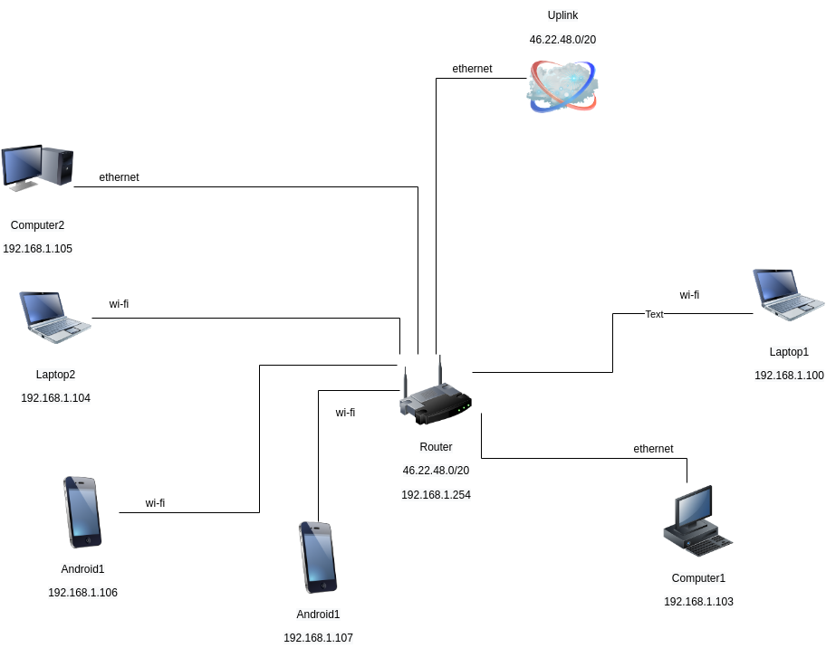

# Домашнее задание к занятию "3.8. Компьютерные сети, лекция 3"

1. Подключитесь к публичному маршрутизатору в интернет. Найдите маршрут к вашему публичному IP
```
telnet route-views.routeviews.org
Username: rviews
show ip route x.x.x.x/32
show bgp x.x.x.x/32
```
```bash
route-views>show ip route 46.22.56.XX
Routing entry for 46.22.48.0/20
  Known via "bgp 6447", distance 20, metric 0
  Tag 6939, type external
  Last update from 64.71.137.241 7w0d ago
  Routing Descriptor Blocks:
  * 64.71.137.241, from 64.71.137.241, 7w0d ago
      Route metric is 0, traffic share count is 1
      AS Hops 2
      Route tag 6939
      MPLS label: none
route-views>show bgp 46.22.56.XX        
BGP routing table entry for 46.22.48.0/20, version 129170454
Paths: (23 available, best #22, table default)
  Not advertised to any peer
  Refresh Epoch 1
  57866 9002 29226 12722 12722 12722
    37.139.139.17 from 37.139.139.17 (37.139.139.17)
      Origin IGP, metric 0, localpref 100, valid, external
      Community: 9002:0 9002:64667
      path 7FE0F2959428 RPKI State not found
      rx pathid: 0, tx pathid: 0
  Refresh Epoch 1
  53767 174 20764 12722 12722 12722 12722 12722
    162.251.163.2 from 162.251.163.2 (162.251.162.3)
      Origin IGP, localpref 100, valid, external
      Community: 174:21101 174:22014 53767:5000
      path 7FE0AE3432A0 RPKI State not found
      rx pathid: 0, tx pathid: 0
  Refresh Epoch 1
  3333 31500 12722 12722
    193.0.0.56 from 193.0.0.56 (193.0.0.56)
      Origin IGP, localpref 100, valid, external
      path 7FE14C2579E0 RPKI State not found
      rx pathid: 0, tx pathid: 0
  Refresh Epoch 1
  1351 8359 29076 12722 12722
    132.198.255.253 from 132.198.255.253 (132.198.255.253)
      Origin IGP, localpref 100, valid, external
      path 7FE0A3316368 RPKI State not found
      rx pathid: 0, tx pathid: 0
  Refresh Epoch 1
  3356 3216 29076 12722 12722
    4.68.4.46 from 4.68.4.46 (4.69.184.201)
      Origin IGP, metric 0, localpref 100, valid, external
      Community: 3216:2001 3216:4477 3356:2 3356:22 3356:100 3356:123 3356:503 3356:903 3356:2067 29076:777 29076:900 29076:50000 29076:50030 29076:52004 29076:60495 29076:64667
      path 7FE16D7675E8 RPKI State not found
      rx pathid: 0, tx pathid: 0
........
........
  Refresh Epoch 1
  19214 3257 1299 12722 12722
    208.74.64.40 from 208.74.64.40 (208.74.64.40)
      Origin IGP, localpref 100, valid, external
      Community: 3257:8108 3257:30391 3257:50002 3257:51200 3257:51203
      path 7FE0CE284F68 RPKI State not found
      rx pathid: 0, tx pathid: 0
```

2. Создайте dummy0 интерфейс в Ubuntu. Добавьте несколько статических маршрутов. Проверьте таблицу маршрутизации.

```bash
root@vagrant:~# echo "dummy" >> /etc/modules
root@vagrant:~# echo "options dummy numdummies=2" > /etc/modprobe.d/dummy.conf
root@vagrant:~# vim /etc/network/interfaces
auto dummy0
iface dummy0 inet static
    address 10.2.2.2/32
    pre-up ip link add dummy0 type dummy
    post-down ip link del dummy0
root@vagrant:~# systemctl restart networking
root@vagrant:~# ip ro add 10.3.0.0/16 via 10.0.2.20 dev eth0 proto static
root@vagrant:~# ip ro add 10.3.0.0/16 via 10.0.2.30 dev eth0 proto static metric 2
root@vagrant:~# ip ro
default via 10.0.2.2 dev eth0 proto dhcp src 10.0.2.15 metric 100 
10.0.2.0/24 dev eth0 proto kernel scope link src 10.0.2.15 
10.0.2.2 dev eth0 proto dhcp scope link src 10.0.2.15 metric 100 
10.3.0.0/16 via 10.0.2.20 dev eth0 proto static 
10.3.0.0/16 via 10.0.2.30 dev eth0 proto static metric 2 
```


3. Проверьте открытые TCP порты в Ubuntu, какие протоколы и приложения используют эти порты? Приведите несколько примеров.

```bash
root@vagrant:~# ss -tnlp
State             Recv-Q            Send-Q                       Local Address:Port                       Peer Address:Port            Process                                                              
LISTEN            0                 4096                               0.0.0.0:111                             0.0.0.0:*                users:(("rpcbind",pid=609,fd=4),("systemd",pid=1,fd=41))            
LISTEN            0                 4096                         127.0.0.53%lo:53                              0.0.0.0:*                users:(("systemd-resolve",pid=610,fd=13))                           
LISTEN            0                 128                                0.0.0.0:22                              0.0.0.0:*                users:(("sshd",pid=1817,fd=3))                                      
LISTEN            0                 4096                                  [::]:111                                [::]:*                users:(("rpcbind",pid=609,fd=6),("systemd",pid=1,fd=43))            
LISTEN            0                 128                                   [::]:22                                 [::]:*                users:(("sshd",pid=1817,fd=4))                     
```
```text
53 - порт DNS
22 - порт SSH
111 - порт rpcbind NFS
```

4. Проверьте используемые UDP сокеты в Ubuntu, какие протоколы и приложения используют эти порты?
```bash
root@vagrant:~# ss -unlp
State             Recv-Q            Send-Q                        Local Address:Port                       Peer Address:Port           Process                                                              
UNCONN            0                 0                             127.0.0.53%lo:53                              0.0.0.0:*               users:(("systemd-resolve",pid=610,fd=12))                           
UNCONN            0                 0                            10.0.2.15%eth0:68                              0.0.0.0:*               users:(("systemd-network",pid=418,fd=19))                           
UNCONN            0                 0                                   0.0.0.0:111                             0.0.0.0:*               users:(("rpcbind",pid=609,fd=5),("systemd",pid=1,fd=42))            
UNCONN            0                 0                                      [::]:111                                [::]:*               users:(("rpcbind",pid=609,fd=7),("systemd",pid=1,fd=44))            
```
```text
53 - порт DNS
68 - порт DHCP для отправки сообщений клиентам
111 - порт rpcbind NFS
```

5. Используя diagrams.net, создайте L3 диаграмму вашей домашней сети или любой другой сети, с которой вы работали. 




 ---
## Задание для самостоятельной отработки (необязательно к выполнению)

6*. Установите Nginx, настройте в режиме балансировщика TCP или UDP.

7*. Установите bird2, настройте динамический протокол маршрутизации RIP.

8*. Установите Netbox, создайте несколько IP префиксов, используя curl проверьте работу API.

 ---

## Как сдавать задания

Обязательными к выполнению являются задачи без указания звездочки. Их выполнение необходимо для получения зачета и диплома о профессиональной переподготовке.

Задачи со звездочкой (*) являются дополнительными задачами и/или задачами повышенной сложности. Они не являются обязательными к выполнению, но помогут вам глубже понять тему.

Домашнее задание выполните в файле readme.md в github репозитории. В личном кабинете отправьте на проверку ссылку на .md-файл в вашем репозитории.

Также вы можете выполнить задание в [Google Docs](https://docs.google.com/document/u/0/?tgif=d) и отправить в личном кабинете на проверку ссылку на ваш документ.
Название файла Google Docs должно содержать номер лекции и фамилию студента. Пример названия: "1.1. Введение в DevOps — Сусанна Алиева".

Если необходимо прикрепить дополнительные ссылки, просто добавьте их в свой Google Docs.

Перед тем как выслать ссылку, убедитесь, что ее содержимое не является приватным (открыто на комментирование всем, у кого есть ссылка), иначе преподаватель не сможет проверить работу. Чтобы это проверить, откройте ссылку в браузере в режиме инкогнито.

[Как предоставить доступ к файлам и папкам на Google Диске](https://support.google.com/docs/answer/2494822?hl=ru&co=GENIE.Platform%3DDesktop)

[Как запустить chrome в режиме инкогнито ](https://support.google.com/chrome/answer/95464?co=GENIE.Platform%3DDesktop&hl=ru)

[Как запустить  Safari в режиме инкогнито ](https://support.apple.com/ru-ru/guide/safari/ibrw1069/mac)

Любые вопросы по решению задач задавайте в чате учебной группы.

---

