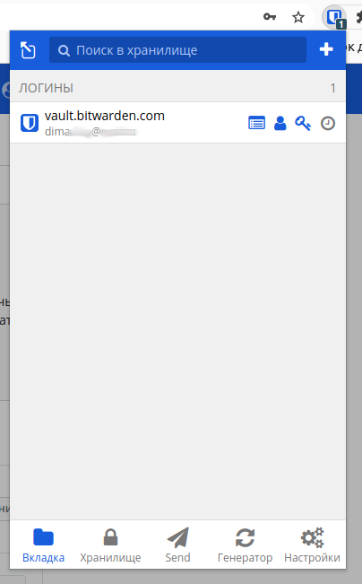
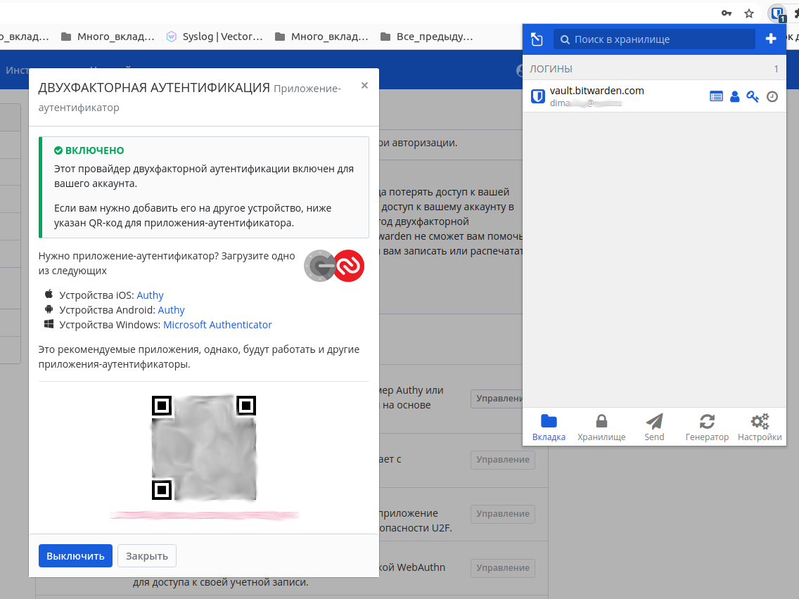
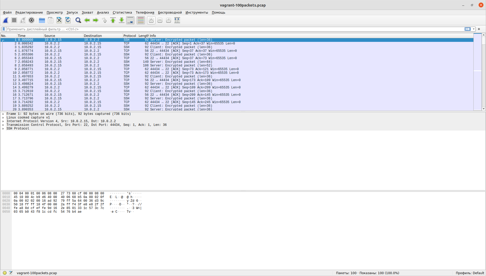

# Домашнее задание к занятию "3.9. Элементы безопасности информационных систем"

1. Установите Bitwarden плагин для браузера. Зарегестрируйтесь и сохраните несколько паролей.

2. Установите Google authenticator на мобильный телефон. Настройте вход в Bitwarden акаунт через Google authenticator OTP.

3. Установите apache2, сгенерируйте самоподписанный сертификат, настройте тестовый сайт для работы по HTTPS.
```bash
..............................
apt install apache2
sudo a2enmod ssl
sudo systemctl restart apache2
..............................

root@vagrant:~#sudo openssl req -x509 -nodes -days 365 -newkey rsa:2048 \
-keyout /etc/ssl/private/apache-selfsigned.key \
-out /etc/ssl/certs/apache-selfsigned.crt \
-subj "/C=RU/ST=Moscow/L=Moscow/O=netology/OU=Org/CN=www.netology.com"
Generating a RSA private key
..........................................................................................+++++
.........................................+++++
writing new private key to '/etc/ssl/private/apache-selfsigned.key'
-----
root@vagrant:~# vim /etc/apache2/sites-available/netology.com.conf
root@vagrant:~# cat /etc/apache2/sites-available/netology.com.conf
<VirtualHost *:443>
   ServerName netology.com
   DocumentRoot /var/www/netology.com
   SSLEngine on
   SSLCertificateFile /etc/ssl/certs/apache-selfsigned.crt
   SSLCertificateKeyFile /etc/ssl/private/apache-selfsigned.key
</VirtualHost>
root@vagrant:~# mkdir /var/www/netology.com
root@vagrant:~# vi !$/index.html
vi /var/www/netology.com/index.html
root@vagrant:~# cat /var/www/netology.com/index.html
<h1>it worked!</h1>
root@vagrant:~# a2ensite netology.com.conf
Enabling site netology.com.
To activate the new configuration, you need to run:
  systemctl reload apache2
root@vagrant:~# apache2ctl configtest
Syntax OK
root@vagrant:~# systemctl reload apache2
root@vagrant:~# echo "127.0.0.1  netology.com" >> /etc/hosts
root@vagrant:~# curl -k https://netology.com
<h1>it worked!</h1>
```

4. Проверьте на TLS уязвимости произвольный сайт в интернете (кроме сайтов МВД, ФСБ, МинОбр, НацБанк, РосКосмос, РосАтом, РосНАНО и любых госкомпаний, объектов КИИ, ВПК ... и тому подобное).
Проверил https://2ip.ru. Есть две потенциальные уязвимости и одна реальная - использование TLS1.
```bash
 Start 2022-01-07 23:44:18        -->> 195.201.201.32:443 (2ip.ru) <<--

 rDNS (195.201.201.32):  2ip.ru.
 Service detected:       HTTP


 Testing vulnerabilities 

 Heartbleed (CVE-2014-0160)                not vulnerable (OK), no heartbeat extension
 CCS (CVE-2014-0224)                       not vulnerable (OK)
 Ticketbleed (CVE-2016-9244), experiment.  not vulnerable (OK)
 ROBOT                                     not vulnerable (OK)
 Secure Renegotiation (RFC 5746)           supported (OK)
 Secure Client-Initiated Renegotiation     not vulnerable (OK)
 CRIME, TLS (CVE-2012-4929)                not vulnerable (OK)
 BREACH (CVE-2013-3587)                    potentially NOT ok, "gzip" HTTP compression detected. - only supplied "/" tested
                                           Can be ignored for static pages or if no secrets in the page
 POODLE, SSL (CVE-2014-3566)               not vulnerable (OK)
 TLS_FALLBACK_SCSV (RFC 7507)              Downgrade attack prevention supported (OK)
 SWEET32 (CVE-2016-2183, CVE-2016-6329)    not vulnerable (OK)
 FREAK (CVE-2015-0204)                     not vulnerable (OK)
 DROWN (CVE-2016-0800, CVE-2016-0703)      not vulnerable on this host and port (OK)
                                           make sure you don't use this certificate elsewhere with SSLv2 enabled services
                                           https://censys.io/ipv4?q=E03715E377AADBD111BFF3D1014A6DC14E9FD79D08F9B828DB78ED5B0369BE40 could help you to find out
 LOGJAM (CVE-2015-4000), experimental      not vulnerable (OK): no DH EXPORT ciphers, no DH key detected with <= TLS 1.2
 BEAST (CVE-2011-3389)                     TLS1: ECDHE-RSA-AES256-SHA ECDHE-RSA-AES128-SHA AES256-SHA CAMELLIA256-SHA AES128-SHA CAMELLIA128-SHA 
                                           VULNERABLE -- but also supports higher protocols  TLSv1.1 TLSv1.2 (likely mitigated)
 LUCKY13 (CVE-2013-0169), experimental     potentially VULNERABLE, uses cipher block chaining (CBC) ciphers with TLS. Check patches
 Winshock (CVE-2014-6321), experimental    not vulnerable (OK) - ARIA, CHACHA or CCM ciphers found
 RC4 (CVE-2013-2566, CVE-2015-2808)        no RC4 ciphers detected (OK)


 Done 2022-01-07 23:45:14 [  58s] -->> 195.201.201.32:443 (2ip.ru) <<--
```

5. Установите на Ubuntu ssh сервер, сгенерируйте новый приватный ключ. Скопируйте свой публичный ключ на другой сервер. Подключитесь к серверу по SSH-ключу.
 ```bash
vagrant@vagrant:~$ ssh-keygen 
Generating public/private rsa key pair.
Enter file in which to save the key (/home/vagrant/.ssh/id_rsa): 
Enter passphrase (empty for no passphrase): 
Enter same passphrase again: 
Your identification has been saved in /home/vagrant/.ssh/id_rsa
Your public key has been saved in /home/vagrant/.ssh/id_rsa.pub
The key fingerprint is:
SHA256:3Y7hxgQFXgUjVGB+Axup9ddqSfx4ja53BmiikpPrblM vagrant@vagrant
The key's randomart image is:
+---[RSA 3072]----+
|       .O=*o.    |
|       +oB .     |
|       o=.o. .   |
|      .  +.o+ .  |
|        S +o.* o |
|        E+.+B = .|
|       + .=+.o . |
|      B ..    o o|
|     ++=    .o o |
+----[SHA256]-----+
vagrant@vagrant:~$ ssh-copy-id ssh_vagrant@localhost
/usr/bin/ssh-copy-id: INFO: Source of key(s) to be installed: "/home/vagrant/.ssh/id_rsa.pub"
The authenticity of host 'localhost (::1)' can't be established.
ECDSA key fingerprint is SHA256:wSHl+h4vAtTT7mbkj2lbGyxWXWTUf6VUliwpncjwLPM.
Are you sure you want to continue connecting (yes/no/[fingerprint])? yes
/usr/bin/ssh-copy-id: INFO: attempting to log in with the new key(s), to filter out any that are already installed
/usr/bin/ssh-copy-id: INFO: 1 key(s) remain to be installed -- if you are prompted now it is to install the new keys
ssh_vagrant@localhost's password: 

Number of key(s) added: 1

Now try logging into the machine, with:   "ssh 'ssh_vagrant@localhost'"
and check to make sure that only the key(s) you wanted were added.

vagrant@vagrant:~$ ssh ssh_vagrant@localhost
Welcome to Ubuntu 20.04.2 LTS (GNU/Linux 5.4.0-80-generic x86_64)

 * Documentation:  https://help.ubuntu.com
 * Management:     https://landscape.canonical.com
 * Support:        https://ubuntu.com/advantage

  System information as of Fri 07 Jan 2022 11:59:18 PM UTC

  System load:  0.1               Processes:               135
  Usage of /:   2.6% of 61.31GB   Users logged in:         1
  Memory usage: 20%               IPv4 address for dummy0: 10.2.2.2
  Swap usage:   0%                IPv4 address for eth0:   10.0.2.15


This system is built by the Bento project by Chef Software
More information can be found at https://github.com/chef/bento
$ 
```
6. Переименуйте файлы ключей из задания 5. Настройте файл конфигурации SSH клиента, так чтобы вход на удаленный сервер осуществлялся по имени сервера.
```bash
vagrant@vagrant:~$ find .ssh/id_rsa* | while read str; do mv $str .ssh/rename_${str: +5}; done
vagrant@vagrant:~$ ls -lh .ssh/rename_*
-rw------- 1 vagrant vagrant 2.6K Jan  7 23:56 .ssh/rename_id_rsa
-rw-r--r-- 1 vagrant vagrant  569 Jan  7 23:56 .ssh/rename_id_rsa.pub
vagrant@vagrant:~$ cat .ssh/config
Host local_vagrant
    Hostname localhost
    User ssh_vagrant
    IdentityFile /home/vagrant/.ssh/rename_id_rsa
vagrant@vagrant:~$ ssh local_vagrant
Welcome to Ubuntu 20.04.2 LTS (GNU/Linux 5.4.0-80-generic x86_64)

 * Documentation:  https://help.ubuntu.com
 * Management:     https://landscape.canonical.com
 * Support:        https://ubuntu.com/advantage

  System information as of Sat 08 Jan 2022 12:18:49 AM UTC

  System load:  0.0               Processes:               133
  Usage of /:   2.6% of 61.31GB   Users logged in:         1
  Memory usage: 20%               IPv4 address for dummy0: 10.2.2.2
  Swap usage:   0%                IPv4 address for eth0:   10.0.2.15


This system is built by the Bento project by Chef Software
More information can be found at https://github.com/chef/bento
Last login: Fri Jan  7 23:59:18 2022 from ::1
$ 
```

7. Соберите дамп трафика утилитой tcpdump в формате pcap, 100 пакетов. Откройте файл pcap в Wireshark.
```bash
vagrant@vagrant:~$ sudo tcpdump -nnei any -c 100 -w vagrant-100packets.pcap
tcpdump: listening on any, link-type LINUX_SLL (Linux cooked v1), capture size 262144 bytes
100 packets captured
107 packets received by filter
0 packets dropped by kernel
```

 ---
## Задание для самостоятельной отработки (необязательно к выполнению)

8*. Просканируйте хост scanme.nmap.org. Какие сервисы запущены?
```bash
vagrant@vagrant:~$ nmap -n scanme.nmap.org
Starting Nmap 7.80 ( https://nmap.org ) at 2022-01-08 00:00 UTC
Nmap scan report for scanme.nmap.org (45.33.32.156)
Host is up (0.18s latency).
Other addresses for scanme.nmap.org (not scanned): 2600:3c01::f03c:91ff:fe18:bb2f
Not shown: 996 closed ports
PORT      STATE SERVICE
22/tcp    open  ssh
80/tcp    open  http
9929/tcp  open  nping-echo
31337/tcp open  Elite

Nmap done: 1 IP address (1 host up) scanned in 38.55 seconds

vagrant@vagrant:~$ nmap -n -p 22,80,9929,31337 -sV --script=banner scanme.nmap.org
Starting Nmap 7.80 ( https://nmap.org ) at 2022-01-08 00:43 UTC
Nmap scan report for scanme.nmap.org (45.33.32.156)
Host is up (0.21s latency).
Other addresses for scanme.nmap.org (not scanned): 2600:3c01::f03c:91ff:fe18:bb2f

PORT      STATE SERVICE    VERSION
22/tcp    open  ssh        OpenSSH 6.6.1p1 Ubuntu 2ubuntu2.13 (Ubuntu Linux; protocol 2.0)
|_banner: SSH-2.0-OpenSSH_6.6.1p1 Ubuntu-2ubuntu2.13
80/tcp    open  http       Apache httpd 2.4.7 ((Ubuntu))
|_http-server-header: Apache/2.4.7 (Ubuntu)
9929/tcp  open  nping-echo Nping echo
| banner: \x01\x01\x00\x18\x8C\x04b a\xD8\xDE\x1D\x00\x00\x00\x00*\x1Fj\x
|_EC\xC3R\x1EX\x07\x0E\x1C\xBB8f\x18\x83\xDE\xBBy\xC7~+\xA4\xF1\x9D\xA...
31337/tcp open  tcpwrapped
Service Info: OS: Linux; CPE: cpe:/o:linux:linux_kernel

Service detection performed. Please report any incorrect results at https://nmap.org/submit/ .
Nmap done: 1 IP address (1 host up) scanned in 23.28 seconds
```
На scanme.nmap.org запущены SSH, APACHE2, NPING-ECHO (входит в пакет nmap) и порт 31337, на котором может быть поднято много вариантов сервисов, в основном трояны и бекдоры, но наппример утилита nencat (nc) в режиме прослушивания, без указания порта, тоже запускается на порте 31337.


Пример работы программы nping-echo
```bash
vagrant@vagrant:~$ sudo nping -c 1 --echo-client "public" scanme.nmap.org

Starting Nping 0.7.80 ( https://nmap.org/nping ) at 2022-01-08 00:50 UTC
SENT (1.8174s) ICMP [10.0.2.15 > 45.33.32.156 Echo request (type=8/code=0) id=53581 seq=1] IP [ttl=64 id=63699 iplen=28 ]
RCVD (1.9980s) ICMP [45.33.32.156 > 10.0.2.15 Echo reply (type=0/code=0) id=53581 seq=1] IP [ttl=63 id=47094 iplen=28 ]
 
Max rtt: 180.474ms | Min rtt: 180.474ms | Avg rtt: 180.474ms
Raw packets sent: 1 (28B) | Rcvd: 1 (46B) | Lost: 0 (0.00%)| Echoed: 0 (0B) 
Nping done: 1 IP address pinged in 2.85 seconds
```

9*. Установите и настройте фаервол ufw на web-сервер из задания 3. Откройте доступ снаружи только к портам 22,80,443
Настроил файервол таким образом: все входящие пакеты - запретить, все исходящие пакеты - разрешить, пакеты на порты 22, 80 и 443 - разрешить. 
```bash
vagrant@vagrant:~$ sudo ufw enable
Firewall is active and enabled on system startup
vagrant@vagrant:~$ sudo ufw default deny incoming
Default incoming policy changed to 'deny'
(be sure to update your rules accordingly)
vagrant@vagrant:~$ sudo ufw default allow outgoing
Default outgoing policy changed to 'allow'
(be sure to update your rules accordingly)
vagrant@vagrant:~$ sudo ufw allow 22/tcp
Rule added
Rule added (v6)
vagrant@vagrant:~$ sudo ufw allow 80/tcp
Rule added
Rule added (v6)
vagrant@vagrant:~$ sudo ufw allow 443/tcp
Rule added
Rule added (v6)
vagrant@vagrant:~$ sudo ufw status verbose
Status: active
Logging: on (low)
Default: deny (incoming), allow (outgoing), disabled (routed)
New profiles: skip

To                         Action      From
--                         ------      ----
22/tcp                     ALLOW IN    Anywhere                  
80/tcp                     ALLOW IN    Anywhere                  
443/tcp                    ALLOW IN    Anywhere                  
22/tcp (v6)                ALLOW IN    Anywhere (v6)             
80/tcp (v6)                ALLOW IN    Anywhere (v6)             
443/tcp (v6)               ALLOW IN    Anywhere (v6)
```

 ---

## Как сдавать задания

Обязательными к выполнению являются задачи без указания звездочки. Их выполнение необходимо для получения зачета и диплома о профессиональной переподготовке.

Задачи со звездочкой (*) являются дополнительными задачами и/или задачами повышенной сложности. Они не являются обязательными к выполнению, но помогут вам глубже понять тему.

Домашнее задание выполните в файле readme.md в github репозитории. В личном кабинете отправьте на проверку ссылку на .md-файл в вашем репозитории.

Также вы можете выполнить задание в [Google Docs](https://docs.google.com/document/u/0/?tgif=d) и отправить в личном кабинете на проверку ссылку на ваш документ.
Название файла Google Docs должно содержать номер лекции и фамилию студента. Пример названия: "1.1. Введение в DevOps — Сусанна Алиева".

Если необходимо прикрепить дополнительные ссылки, просто добавьте их в свой Google Docs.

Перед тем как выслать ссылку, убедитесь, что ее содержимое не является приватным (открыто на комментирование всем, у кого есть ссылка), иначе преподаватель не сможет проверить работу. Чтобы это проверить, откройте ссылку в браузере в режиме инкогнито.

[Как предоставить доступ к файлам и папкам на Google Диске](https://support.google.com/docs/answer/2494822?hl=ru&co=GENIE.Platform%3DDesktop)

[Как запустить chrome в режиме инкогнито ](https://support.google.com/chrome/answer/95464?co=GENIE.Platform%3DDesktop&hl=ru)

[Как запустить  Safari в режиме инкогнито ](https://support.apple.com/ru-ru/guide/safari/ibrw1069/mac)

Любые вопросы по решению задач задавайте в чате учебной группы.

---

